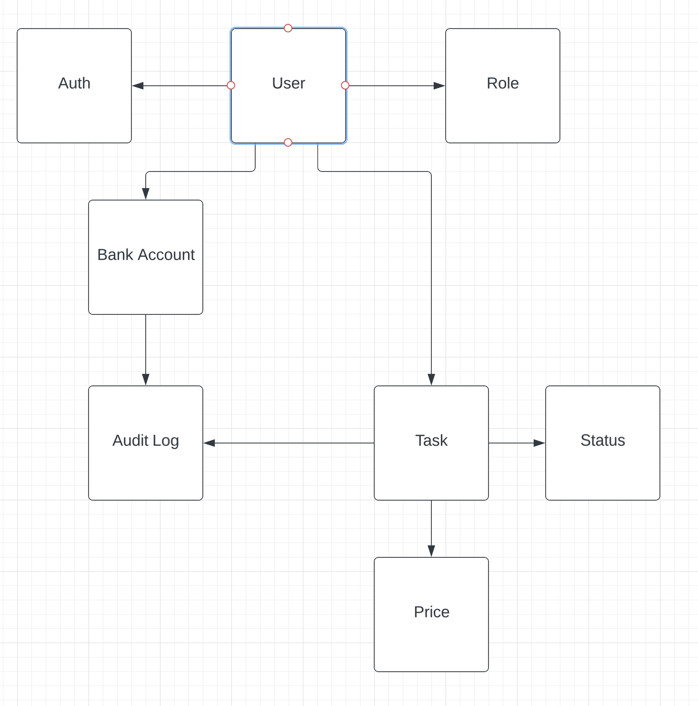
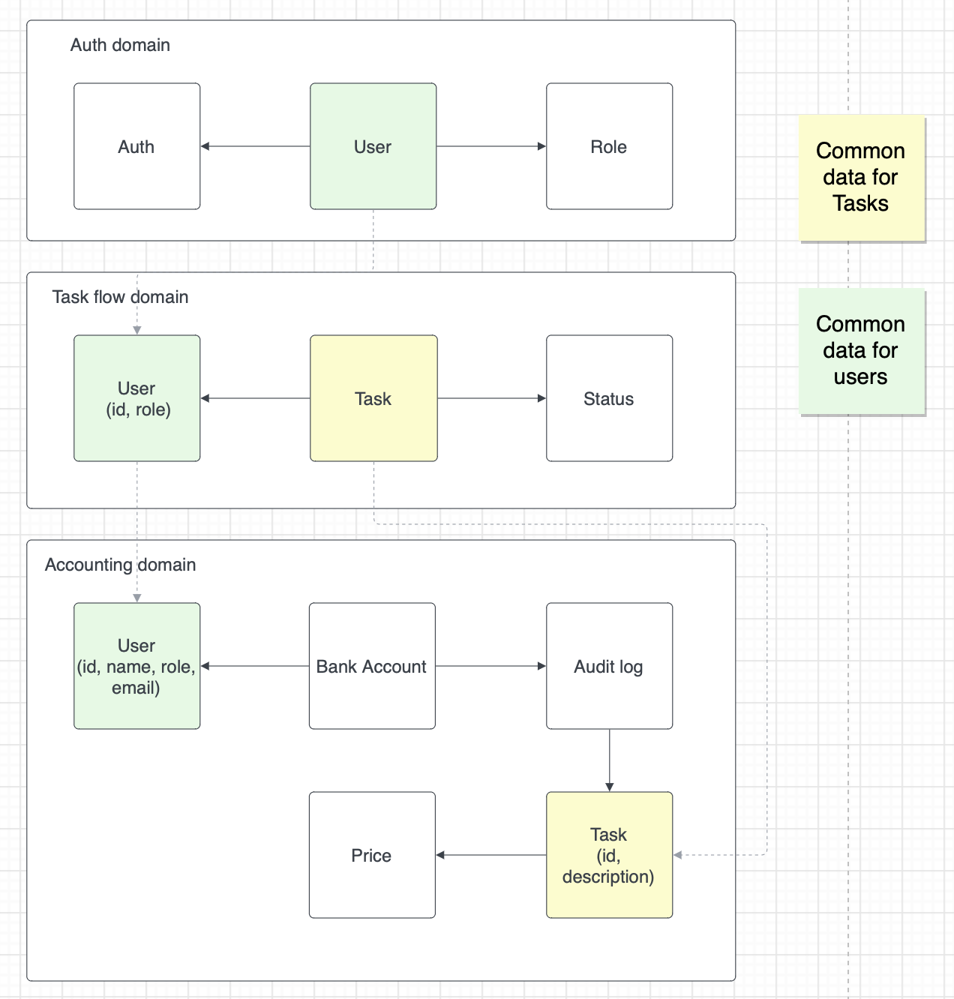
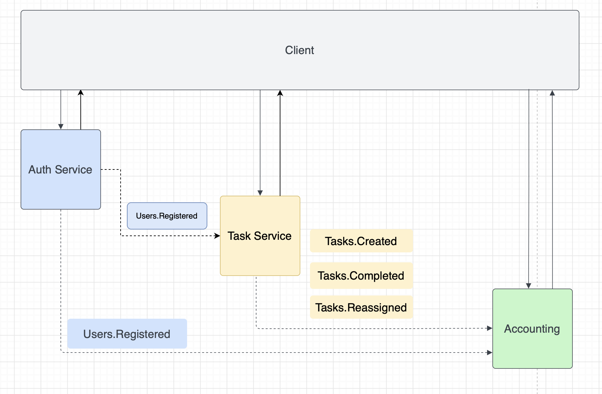

## Разбор бизнес требовании на составляющие
Задача: Разобрать каждое требование на составляющие (актор, команда, событие, query).
Определить, как все бизнес цепочки будут выглядеть и на какие шаги они будут разбиваться.

### Регистрация в системе

- query: -  
- actor: User  
- command: Register user  
- event: Users.Registered

### Авторизация в системе

- query: -  
- actor: User (with roles: admin, manager, developer, accountant)  
- command: Authorize user  
- event: -

### Создание новых тасок
```
Новые таски может создавать кто угодно (администратор,
начальник, разработчик, менеджер и любая другая роль).
```

- query: Users ids  
- actor: User (with roles: admin, manager, developer, accountant)  
- command: Create task  
- event: Tasks.Created  

### Оценка задач
```
цены на задачу определяется единоразово, в момент появления в системе
(можно с минимальной задержкой)
```

- query: Task
- actor: Tasks.Created
- command: Calculate task price
- event: Tasks.Calculated

### Переназначение задач
```
Менеджеры или администраторы должны иметь кнопку «заассайнить задачи»,
которая возьмёт все открытые задачи и рандомно заассайнит каждую на любого
из сотрудников (кроме менеджера и администратора)
```

- query: Open tasks + Users ids with roles (developer, accountant)  
- actor: User (with roles: admin, manager)  
- command: Reassign tasks    
- event: Tasks.Reassigned  

### Просмотр списка задач в таск менеджере
```
Каждый сотрудник должен иметь возможность видеть в
отдельном месте список заассайненных на него задач
```
 
- query: User tasks  
- actor: User  
- command: -  
- event: -

### Выполнение задач
```
Каждый сотрудник должен иметь возможность отметить задачу выполненной
```

- query: User id, Task
- actor: User
- command: Complete task
- event: Tasks.Completed

### Аккаунтинг: Создание счета
```
У каждого из сотрудников должен быть свой счёт,
который показывает, сколько за сегодня он получил денег.
```

- query: -
- actor: Users.Registered
- command: Create bank account
- event: BankAccounts.Created

### Аккаунтинг: Списание денег со счета сотрудника
```
деньги списываются сразу после ассайна на сотрудника
```

- query: Task, BankAccount
- actor: Tasks.Created, Tasks.Reassigned
- command: Charge money from user account
- event: BankAccounts.Debited

### Аккаунтинг: Начисление денег на счет сотрудника
```
деньги начисляются после выполнения задачи.
```

- query: Task, BankAccount
- actor: Tasks.Completed
- command: Deposit money to user account
- event: BankAccounts.Refilled

### Аккаунтинг: Перенос отрицательного баланса
```
отрицательный баланс переносится на следующий день.
Единственный способ его погасить - закрыть достаточное
количество задач в течение дня.
```

Для переноса ничего делать ненужно.
Положительный баланс будет выполнен, с отрицательным ничего не делается.

### Аккаунтинг: Выплатить зарплату
```
В конце дня необходимо:  
1. считать сколько денег сотрудник получил за рабочий день (это сумма на счете)
2. если сумма положительная выплатить ее, обнулить баланс
3. создать запись в аудит логе
4. отправить уведомление
```

- query: User, BankAccount
- actor: ScheduledJob
- command: Pay day salary
- event: BankAccounts.Paid

### Аккаунтинг: Отправить уведомление
```
Отправить уведомление о выплаченной сумме
```

- query: User (id, name, email), PaySum
- actor: BankAccounts.Paid
- command: Send email
- event: Notifications.send

### Аккаунтинг: Хранение аудит лога
```
У счёта должен быть аудитлог того, за что были списаны
или начислены деньги, с подробным описанием каждой из задач
```

- query: Task, BankAccount
- actor: BankAccounts.Debited, BankAccounts.Refilled, BankAccounts.Paid
- command: Create audit record
- event: AuditLogs.Created


### Аккаунтинг дашборд: Просмотр лога и баланса обычными попугами

- query: AuditLogs, BankAccounts

### Аккаунтинг дашборд: Просмотр прибыли админами и бухгалтерами
```
Дешборд должен выводить количество заработанных топ-менеджментом за сегодня денег.    
т.е. сумма всех закрытых и заасайненых задач за день с противоположным знаком:


(sum(completed task amount) + sum(assigned task fee)) * -1
```

- query: AuditLogs (current day)

### Аккаунтинг дашборд: Просмотр админами и бухгалтерами статистики по дням
```
Под статистикой по дням понимаю сколько заработали за предыдущие дни
```

- query: AuditLogs (previous days)

### Аналитика: сколько заработал топ-менеджмент за сегодня

- query: AuditLogs (current day)

### Аналитика: сколько попугов ушло в минус

- query: BankAccounts

### Аналитика: самая дорогая задача за день, неделю или месяц

- query: Task Prices (for time interval)

## Бизнес цепочки
- Register user -> Create bank account
- Create task -> Calculate task price -> Charge money from user account  
- Reassign tasks -> Charge money from user bank account -> Create audit record
- Complete task -> Deposit money to user bank account -> Create audit record
- Pay day salary -> Create audit record -> Send email

## Модель данных


## Модель доменов

Контексты:
- Авторизация
- Флоу работы с задачами
- Аккаунтинг



## Сервисы
Каждый домен будет соответствовать одному сервису. То есть будет 3 сервиса:
- сервис авторизации
- сервис работы с задачами
- сервис аккаунтинга (здесь же отправка писем и аналитика)

Сервис для отображения данных, дашбордов пока не рассматриваю.
Возможно взаимодействие с указанными сервисами будет происходить посредством JSON API.
Если останется время, то сделаю отдельный сервис для фронта.



## Бизнес события
- Users.Registered
- Tasks.Created
- Tasks.Calculated
- Tasks.Reassigned
- Tasks.Completed
- BankAccounts.Created
- BankAccounts.Debited
- BankAccounts.Refilled
- BankAccounts.Paid
- Notifications.send
- AuditLogs.Created

## CUD События
- Users.Registered. Auth Service -> Task Service. Data: User.id, User.Role 
- Users.Registered. Auth Service -> Accounting. Data: User.id, User.role, User.name, User.email
- Tasks.Created. Task Service -> Accounting. Data: Task.id, Task.Description